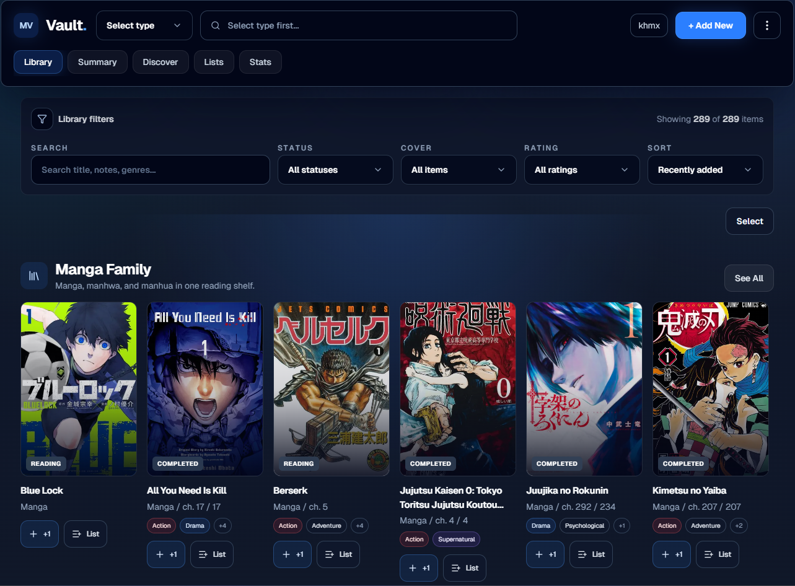
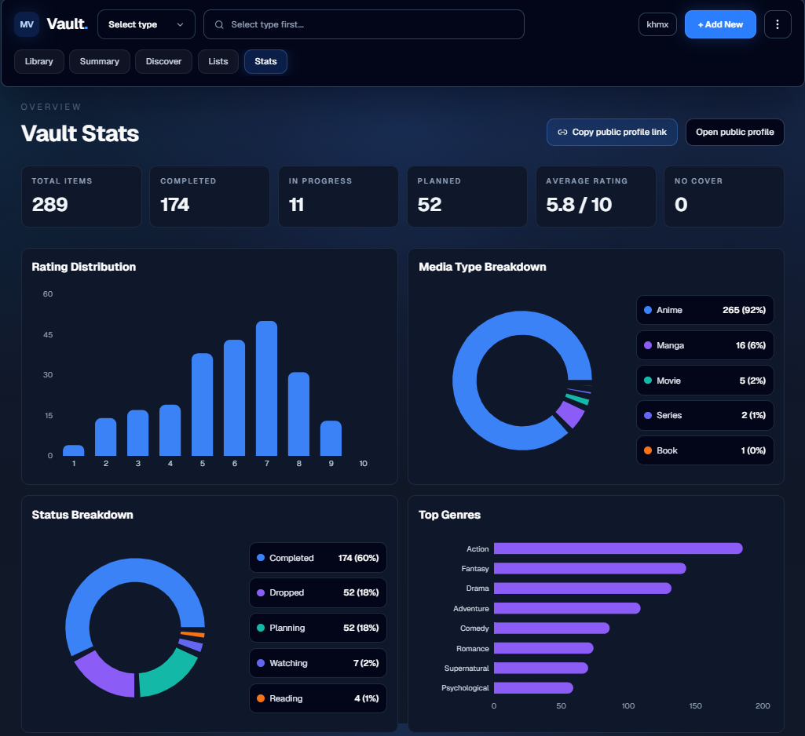
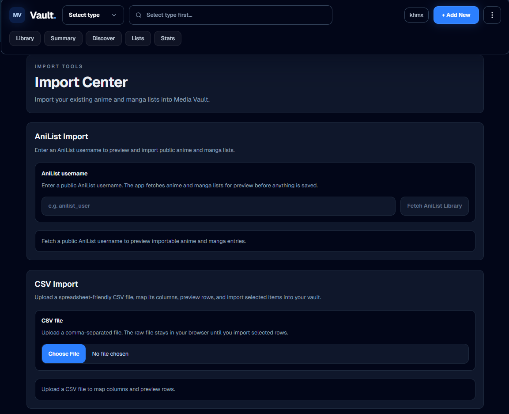
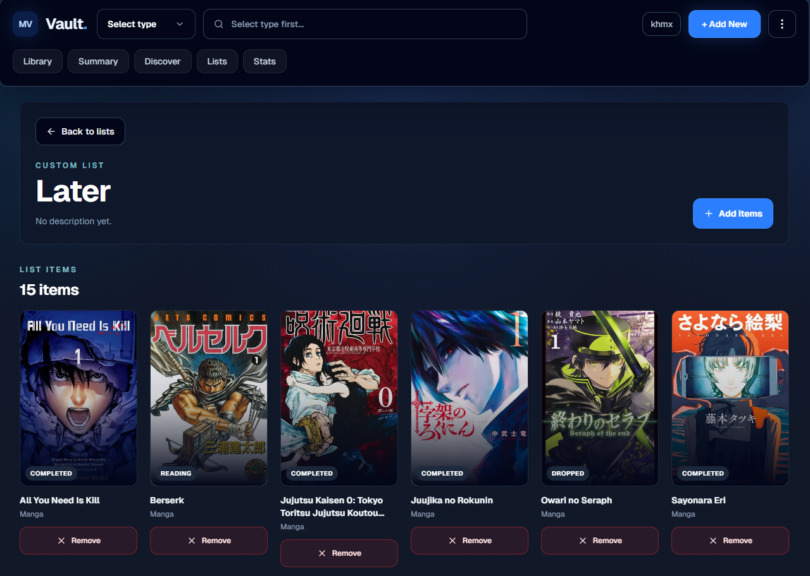
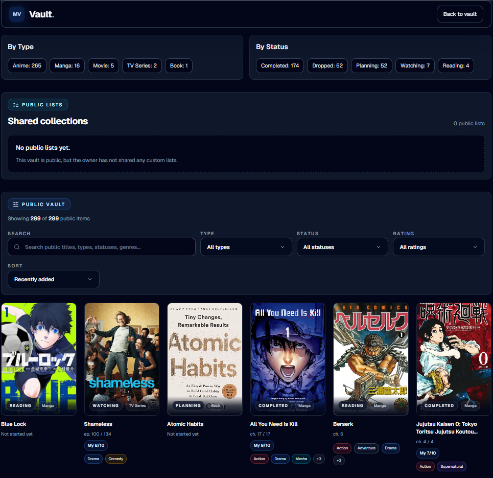
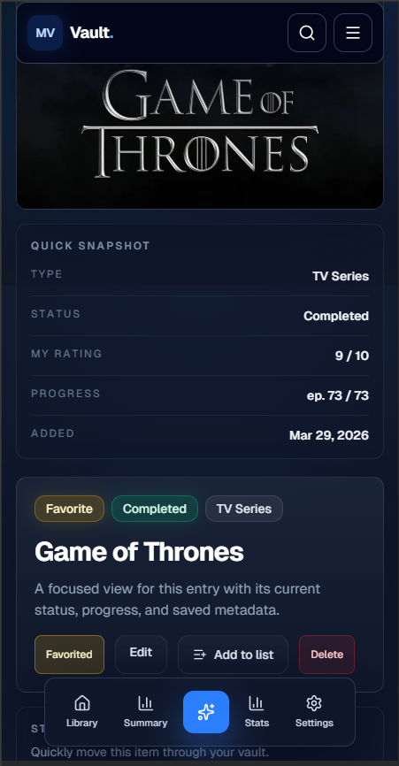

# Media Vault


Media Vault is a personal media tracker for anime, manga, movies, series, and
books. It gives each signed-in user a private vault with imports, backups,
stats, custom lists, and optional read-only public sharing.

## Live Demo

[https://media-vault-seven.vercel.app](https://media-vault-seven.vercel.app)

## Screenshots

Add the screenshot PNGs to `public/screenshots/` to populate this section.

| Library | Stats |
|---|---|
|  |  |

| Import Center | Custom Lists |
|---|---|
|  |  |

| Public Profile | Mobile View |
|---|---|
|  |  |

## Portfolio highlights

- Full-stack Next.js App Router project with TypeScript.
- Supabase Auth, PostgreSQL, and RLS for private/public access control.
- External API integrations with AniList GraphQL and TMDB.
- Import pipelines for MyAnimeList XML, AniList, and CSV.
- Public read-only sharing with `/u/[username]`.
- Analytics dashboard with Recharts.
- CI with GitHub Actions and deployment on Vercel.
- Production monitoring with Sentry.

## Architecture

Media Vault uses Next.js App Router for routing, Server Components, and Server
Actions. Supabase provides authentication, PostgreSQL storage, and row-level
security for private vault data and public read-only sharing. AniList GraphQL
and TMDB power external metadata search and imports, while Recharts renders the
analytics dashboard. Vercel handles deployment, GitHub Actions runs CI, and
Sentry captures production errors.

## Suggested demo flow

1. Sign in.
2. Search and add a title.
3. Edit rating, progress, and Markdown notes.
4. Import from MyAnimeList or AniList.
5. View Stats.
6. Create a custom list.
7. Enable public profile and open `/u/[username]`.
8. Export a backup.

## Tech stack

- Next.js App Router
- React
- TypeScript
- Tailwind CSS
- Supabase Auth, Postgres, and RLS
- AniList GraphQL for anime/manga metadata and imports
- TMDB API for movie/series discovery
- Recharts for analytics
- Vercel for deployment
- Sentry for production error monitoring

## Main features

- Private media library with shelves for anime, manga, movies, series, and books
- Advanced library filters, sorting, cover filters, source filters, and bulk delete
- Discover/search flows for adding new titles
- MyAnimeList XML import with preview, duplicate protection, and cover enrichment
- AniList username import and Generic CSV import when enabled in the Import Center
- Fill Missing Covers utility for imported anime/manga
- JSON and CSV backup export plus JSON restore preview with duplicate skipping
- Custom private lists with add/remove existing vault items
- Optional public profile at `/u/[username]`
- Optional public read-only custom list sharing
- Stats dashboard with ratings, media mix, status, genres, monthly additions, and insights
- Settings, onboarding checklist, and auth recovery flows

## Environment variables

Create `.env.local` for development:

```bash
NEXT_PUBLIC_SUPABASE_URL=your-supabase-project-url
NEXT_PUBLIC_SUPABASE_ANON_KEY=your-supabase-anon-key
SUPABASE_SERVICE_ROLE_KEY=your-service-role-key
NEXT_PUBLIC_TMDB_API_KEY=your-tmdb-api-key
NEXT_PUBLIC_SITE_URL=http://localhost:3000
```

For production on Vercel:

```bash
NEXT_PUBLIC_SITE_URL=https://media-vault-seven.vercel.app
```

Never commit real secrets. Use Vercel Environment Variables for production.

## Local development

```bash
npm install
npm run dev
```
## Supabase setup

Run the SQL migrations in `supabase/migrations` in order for the full feature
set. The key migrations are:

- `20260326_auth_user_ownership.sql` for `items.user_id` and RLS
- `20260326_item_metadata.sql` for notes, total progress, and timeline fields
- `20260326_item_favorites.sql` for favorites
- `20260326_item_genres.sql` for genre tags and stats
- `20260330_external_ratings.sql` for external scores/source metadata
- `20260426_custom_lists.sql` for custom lists and list items
- `20260427_public_profiles.sql` for username-based public profiles
- `20260427_public_profiles_lists.sql` for public list sharing

The app uses compatibility fallbacks where practical, but production portfolio
use should apply the migrations so imports, public profiles, lists, and backups
work with the intended schema.

## Auth redirect setup

In Supabase Dashboard:

```text
Authentication -> URL Configuration
```

Set Site URL:

```text
https://media-vault-seven.vercel.app
```

Add Redirect URLs:

```text
https://media-vault-seven.vercel.app/auth/callback
https://media-vault-seven.vercel.app/auth/reset-password
http://localhost:3000/auth/callback
http://localhost:3000/auth/reset-password
```

See [docs/auth-setup.md](docs/auth-setup.md) for email confirmation and password
reset details.

## Deployment

The app is deployed on Vercel and connected to this GitHub repository.

Every push to the `main` branch triggers a production deployment automatically.

Production: https://media-vault-seven.vercel.app

## CI

GitHub Actions runs lint and production build checks on every push and pull
request to `main`.

The workflow requires these GitHub repository secrets:

- `NEXT_PUBLIC_SUPABASE_URL`
- `NEXT_PUBLIC_SUPABASE_ANON_KEY`
- `NEXT_PUBLIC_TMDB_API_KEY` for TMDB-backed search parity, if available

Public pages are read-only and gated by Supabase RLS. Private controls such as
edit, delete, bulk delete, import, backup, add-to-list, and progress updates are
not shown on public profile/list routes.

## Project docs

- [Auth setup](docs/auth-setup.md)
- [Public profile and public list setup](docs/profile-settings-plan.md)
- [Final QA checklist](docs/final-qa-checklist.md)
